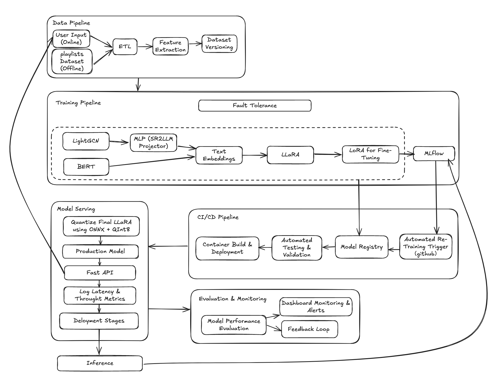

# MLOps_Spring_2025 Project Proposal: LLaRA++ — A cold-start music recommendation system that integrates behavior and text

## LLaRA++: Beyond Language Modeling — Hybrid Embedding and User-Aware Curriculum for Cold-Start Music Recommendation
LLaRA++ is a cold-start music recommendation system that unifies graph-based collaborative filtering (LightGCN) and text-based embeddings (BERT/DistilBERT) to address minimal interaction data. An MLP projector (SR2LLM) aligns LightGCN embeddings into a language model space, enabling LLaRA with curriculum prompt tuning for enhanced predictions. Deployed via ONNX QInt8 quantization in a FastAPI service and orchestrated by a CI/CD pipeline, LLaRA++ offers scalable, low-latency inference. Its primary users are music streaming platforms and ML teams seeking advanced yet practical solutions to cold-start problems.

## Contributors
| Name             | Responsible for                                      | Link to their commits in this repo             |
|------------------|-------------------------------------------------------|------------------------------------------------|
| All team members | Overall system design, integration, and documentation |       |
| Muyuan Zhang        | Model training (LightGCN, Projector, LLaRA)           |  |
| Siqi Xu       | Model quantization, FastAPI deployment & monitoring   |  |
| Yufei Wang         | Data preprocessing, lyric/title embedding, cold start |  |
| Steven Wang       | CI/CD, pipeline integration, dashboard                |  |

## System diagram


## Summary of outside materials
| Dataset / Model                         | How it was created                                            | Conditions of use |
|----------------------------------------|----------------------------------------------------------------|-------------------|
| [Million Playlist Dataset (MPD)](https://www.aicrowd.com/challenges/spotify-million-playlist-dataset-challenge)         | Collected from US Spotify users 2010–2017, 1M playlists        | Research only, under AIcrowd challenge license|
| [DistilBERT / BERT](https://github.com/Steven-wyf/MLOps_Spring_2025/blob/main/bert-powered%20book%20genre%20classfication.pdf)                      | Pretrained on Wikipedia + BookCorpus                         | Open under Apache 2.0       |
| [LightGCN Enhanced (from paper)](https://github.com/Steven-wyf/MLOps_Spring_2025/blob/main/Embedding%20Enhancement%20Method%20for%20LightGCN%20in%20Recommendation%20Information%20Systems.pdf)       | Constructed from playlist-track-user graph                   | Public research use         |
| [LLaRA code from SIGIR ’24 paper](https://github.com/Steven-wyf/MLOps_Spring_2025/blob/main/llara.pdf)      | Hybrid prompt & curriculum tuning idea                       | MIT License on GitHub       |

The Million Playlist Dataset(MPD) contains 1,000,000 Playlists. The playlists contain over 2 million unique tracks by 300,00 artists. 
Each data entry is formatted as followed:
```json
{
        "name": "musical",
        "collaborative": "false",
        "pid": 5,
        "modified_at": 1493424000,
        "num_albums": 7,
        "num_tracks": 12,
        "num_followers": 1,
        "num_edits": 2,
        "duration_ms": 2657366,
        "num_artists": 6,
        "tracks": [
            {
                "pos": 0,
                "artist_name": "Degiheugi",
                "track_uri": "spotify:track:7vqa3sDmtEaVJ2gcvxtRID",
                "artist_uri": "spotify:artist:3V2paBXEoZIAhfZRJmo2jL",
                "track_name": "Finalement",
                "album_uri": "spotify:album:2KrRMJ9z7Xjoz1Az4O6UML",
                "duration_ms": 166264,
                "album_name": "Dancing Chords and Fireflies"
            },
            {
                "pos": 1,
                "artist_name": "Degiheugi",
                "track_uri": "spotify:track:23EOmJivOZ88WJPUbIPjh6",
                "artist_uri": "spotify:artist:3V2paBXEoZIAhfZRJmo2jL",
                "track_name": "Betty",
                "album_uri": "spotify:album:3lUSlvjUoHNA8IkNTqURqd",
                "duration_ms": 235534,
                "album_name": "Endless Smile"
            },
            {
                "pos": 2,
                "artist_name": "Degiheugi",
                "track_uri": "spotify:track:1vaffTCJxkyqeJY7zF9a55",
                "artist_uri": "spotify:artist:3V2paBXEoZIAhfZRJmo2jL",
                "track_name": "Some Beat in My Head",
                "album_uri": "spotify:album:2KrRMJ9z7Xjoz1Az4O6UML",
                "duration_ms": 268050,
                "album_name": "Dancing Chords and Fireflies"
            },
            // 8 tracks omitted
            {
                "pos": 11,
                "artist_name": "Mo' Horizons",
                "track_uri": "spotify:track:7iwx00eBzeSSSy6xfESyWN",
                "artist_uri": "spotify:artist:3tuX54dqgS8LsGUvNzgrpP",
                "track_name": "Fever 99\u00b0",
                "album_uri": "spotify:album:2Fg1t2tyOSGWkVYHlFfXVf",
                "duration_ms": 364320,
                "album_name": "Come Touch The Sun"
            }
        ],

    }
```
The dataset describes the content of each playlists, which imply relationships between users and tracks.
## Summary of Infrastructure Requirements

| Requirement       | How Many / When                                      | Justification                                                                 |
|-------------------|------------------------------------------------------|-------------------------------------------------------------------------------|
| `m1.medium` VMs   | 3 VMs for the entire project duration                | For running lightweight services including data preprocessing, genre tagging, and API server components. |
| `gpu_mi100`       | 4-hour blocks, twice per week (total ~32 hours)     | Required for training LLaRA with LoRA adapters, tuning LightGCN embeddings, and running curriculum-based prompt tuning. |
| Floating IPs      | 1 persistent, 1 temporary during staging deployments | Persistent IP for stable API endpoint access; a second IP for temporary staging/canary testing. |
| Persistent Storage| 100GB volume attached for the full project duration | To store datasets, training artifacts, model checkpoints, ONNX binaries, and streaming logs across pipelines. |
| Ray Cluster       | Dynamically scaled during training & evaluation     | Used for scheduling training jobs and distributed hyperparameter tuning (Ray Tune). |
| MLflow Server     | 1 containerized instance                             | Required for tracking experiments and managing model metadata during development. |


## Detailed design plan

### Model training and training platforms
- Use **LightGCN** to model user-item sequence graph behavior embeddings【43†Embedding Enhancement Method for LightGCN】
- Use **BERT/DistilBERT** to embed textual features (title, artist, lyrics)【39†Exploring Genre with DistilBERT】【43†bert-powered book genre classfication.pdf】
- Train an MLP projector (SR2LLM) to align LightGCN ID embedding into LLM space
- Use **LLaRA** as core model: start with text-only prompting, then curriculum prompt tuning to inject behavior features【43†llara.pdf】
- Use **LoRA** for efficient fine-tuning
- Track experiments with **MLflow**

The proposed design integrates collaborative filtering and textual embeddings to enhance music recommendation. It first employs LightGCN to model user-item interaction graphs, capturing behavioral patterns in sequence embeddings. Textual metadata—including titles, artists, and lyrics—are embedded via DistilBERT or BERT, enriching item representations with semantic depth. A multilayer perceptron (MLP) projector (SR2LLM) is trained to map these LightGCN behavioral embeddings into the LLM embedding space. The core recommendation model, LLaRA, is initially fine-tuned using text-only prompting and subsequently refined through curriculum prompt tuning, gradually incorporating behavioral embeddings. Efficient model updates are achieved via LoRA fine-tuning. Finally, MLflow is utilized for comprehensive experiment tracking and reproducibility.

### Model serving and monitoring platforms
- Quantize final LLaRA model using **ONNX + QInt8**【40†LLM Quantization】
- Serve with **FastAPI** with support for batching
- Log latency and throughput metrics
- Set up 3 deployment stages: staging, canary, production
- Model performance evaluation

By converting the trained LLaRA model to ONNX format and applying QInt8 quantization, we transform high-precision floating-point parameters into 8-bit integers. This could significantly reduces the model size and computational requirements. The process not only accelerates inference but also maintains robust performance in resource-constrained environments while keeping accuracy loss within acceptable limits.
  
The we deploy the inference service with FastAPI, which leverages its high performance and asynchronous capabilities. while the batching mechanism consolidates multiple requests into a single model call, it could greatly enhance throughput and response efficiency. This step ensures that the system handles high concurrency effectively and delivers accurate inference results, laying a solid foundation for subsequent monitoring and logging.
  
Logging key performance metrics such as latency and throughput during inference enables us to quickly identify system bottlenecks and anomalies. By integrating monitoring tools like Prometheus and Grafana, we automatically collect response times, QPS, and other data after each request, aggregating these metrics into a central monitoring platform for timely resource adjustments and service optimization.
  
The last step of model serving is that we need to divide the deployment process into three stages—Staging, Canary, and Production, which allows us to gradually validate the new model's stability and performance. The model is first tested for functionality and security in the Staging environment, then a small portion of live traffic is directed to it during the Canary phase for real-time monitoring, and finally, once stability is confirmed, it is fully rolled out to Production. Automatic rollback mechanisms are in place to quickly revert to a stable version if any anomalies are detected, ensuring a seamless user experience.
  
In the model evaluation stage, we employ both offline testing and online monitoring to comprehensively assess the overall performance of the model. Offline evaluation is conducted on historical test datasets by calculating metrics such as accuracy, recall, and F1 score to gauge performance on static data. Online evaluation, on the other hand, monitors real-world performance through A/B testing, real-time user feedback, click-through rate (CTR), and conversion rate metrics. The evaluation results help determine whether the new model meets the desired performance standards, identify potential issues early, and provide data-driven insights for continuous iteration and improvement. These insights are fed back into the training pipeline, creating a continuous improvement loop for the model.

### Data pipeline
- Use Python scripts to extract playlist → seed tracks → target for next-track prediction
 - Lyrics/title embedding and genre classification for cold start
 - Streaming simulation for inference testing
 - Persistent volume stores track embeddings, models, test logs
 - Preprocessing scripts + evaluation pipeline containerized

The data pipeline starts by collecting data from two primary sources: real-time user inputs and an offline playlist dataset. Python scripts extract key components from these sources—identifying seed tracks and their corresponding next-track labels. The raw data is then processed through an ETL phase where it is extracted, cleansed (removing duplicates and handling missing values), and standardized into a consistent format. Finally, the cleaned data is loaded into an intermediate storage area for further use.

Following data ingestion and ETL, the pipeline moves into feature extraction and dataset management. In this stage, song lyrics and titles are converted into text embeddings that capture their semantic context, while tracks are classified by genre to enrich the metadata—a crucial step for cold start scenarios. Additionally, numerical representations of the tracks are computed as key features for next-track prediction. To ensure reproducibility and facilitate debugging, each processed dataset version is recorded along with detailed annotations of the transformation steps.

### Continuous X
- Use **Terraform/Helm** to define infrastructure
- Set up GitHub Actions CI/CD to automate data → train → deploy
- Stage model updates using ArgoCD
- Auto-deploy passing models to canary → production if metrics are met
- Dashboard monitoring + alerting for model drift & service anomalies

---
