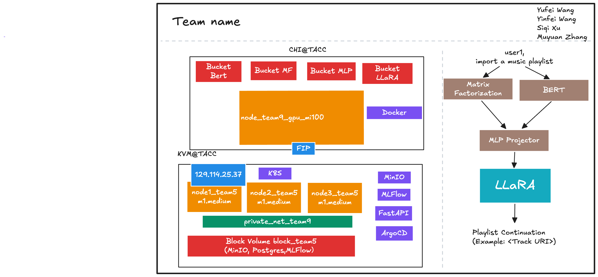

# LLaRA++ — A Cold-Start Music Recommendation System

##  Value Proposition (Unit 1)
The [project proposal](./ProjectProposal.md) is located at the repo base directory.

**Customer**: Music streaming platforms (e.g., Spotify) targeting new users with sparse interaction histories.

**Value**: LLaRA++ helps recommend personalized songs to new users by combining user-item interaction graphs and song metadata (title, artist, lyrics). This enables better discovery and retention from day one.

**Scale**:

* **Dataset**: 1M playlists (≈20GB), >2M unique tracks.
* **Model size**: Final LLaRA model ≈ 1.3 GB + MLP Projector ≈ 500 MB.
* **Deployment**: Up to 1K inference requests/hour.

##  Cloud-Native Infrastructure (Unit 2/3 - Steven Wang)

* Provisioned using Terraform + KVM in [`tf/`](./tf/).
* MLflow & MinIO deployed via Helm + ArgoCD in [`k8s/platform`](./k8s/platform).
* Services staged in `staging`, `canary`, `production` under [`k8s/`](./k8s).
* CI/CD orchestration in [`ansible/`](./ansible).

* Usage: After setting ansible,
  ```shell
  # Run pre-config
  ansible-playbook ./ansible/pre_k8s/pre_k8s_configure.yml
  # Install k8s
  cd /mnt/object/MLOps_Spring_2025/ansible/k8s/kubespray
  ansible-playbook -i ../inventory/mycluster --become --become-user=root ./cluster.yml

  # Post-install playbook to bring up ArgoCD
  cd /mnt/object/MLOps_Spring_2025/ansible
  ansible-playbook -i inventory.yml post_k8s/post_k8s_configure.yml

  # If you did not edit any of the path, run the following
  export PATH=/work/.local/bin:$PATH
  export PYTHONUSERBASE=/work/.local
  export ANSIBLE_CONFIG=/mnt/object/MLOps_Spring_2025/ansible/ansible.cfg
  export ANSIBLE_ROLES_PATH=roles

  # Platform installation, this would bring up MLFlow, MinIO, Postgres
  cd /mnt/object/MLOps_Spring_2025/ansible
  ansible-playbook -i inventory.yml argocd/argocd_add_platform.yml


##  Persistent Storage + Data (Unit 8 - Data Person: Yufei Wang)
  * Persistant Stoarge: `/mnt/object/`, mounted to the container on CHI@TACC, named mlops_project9_persistant

  * Offline Data: `/mnt/object/processed_data`

* **Training Data**: [`data_processing/`](./data_processing)

  * MPD: million\_playlist\_dataset.json
  * Example sample:

    ```json
    {
      "name": "musical",
      "tracks": [
        {"track_name": "Finalement", "artist_name": "Degiheugi"}, ...
      ]
    }
    ```
The processed training data is very large, so it located at `mnt/object/processed`.


* **ETL and Pipeline**: Retrieve data from [Spotify](https://www.aicrowd.com/challenges/spotify-million-playlist-dataset-challenge)-> Extract → Clean → [Embed lyrics/title](./data_processing/data_preprocess.py) → [Text Embedding and Train](./train/)

* How to prevent data leakage: During model training, we randomized the order to tracks in a playlist, then splited the playlist to 80% training, 10% testing, and 10% validation set. The output of model on certain playlist id will be used to compare with the tracks we split in validation set on cross matching.

##  Model Training (Unit 4/5 - Muyuan Zhang)
* Modeling: 
  * Import: there are type of data being formatted from the raw data:
  `track_text.json` for BERT embedding
    ```json
    {
      "spotify:track:0UaMYEvWZi0ZqiDOoHU3YI": "Lose Control (feat. Ciara & Fat Man Scoop) by Missy Elliott from The Cookbook",
    "spotify:track:6I9VzXrHxO9rA9A5euc8Ak": "Toxic by Britney Spears from In The Zone",
    "spotify:track:0WqIKmW4BTrj3eJFmnCKMv": "Crazy In Love by Beyoncé from Dangerously In Love (Alben für die Ewigkeit)",
    }
    ```
    `playlist_track_pairs.csv` for Matrix factorization
    ```raw
    playlist_id	          track_uri
    0	            spotify:track:0UaMYEvWZi0ZqiDOoHU3YI
    0	            spotify:track:6I9VzXrHxO9rA9A5euc8Ak
    ```
  * [`DistrilBert`](./train/bert_encoding.py): A light version of `BERT` to encode the text description of each track.
  * [`Matrix Factorization`](./train/matrix_factorization.py): The original plan is use `LightGCN` to generate user-behavior graphs to link each playlist id to the tracks they like. Due to the size of data and computing resouces, trainig of `LightGCN` would result in over 24 hour training so we switched to `Matrix Factorization`. The model would also be able to learn user behavior, instead of using 1-1 graph, but 1 -> matrix. This would significantly reduce the training time.
  * [`MLP Projector`](./train/mlp_train.py): The original plan is using `SR2LLM` as projector to align the embeddings from previous two models. However, due to the amount of data, we switched to a one-layer MLP projector in this part.
  * [`LLaRA`](./train/llara_train.py): The Linear layer with Regularization and Activation (LlaRA) is used as our final output model which would learn the user-behavior
* Inputs: Playlist (tracks), lyrics, artist names
* Outputs: Recommend the suggsted track uri
* Traing and Re-training: The automation can triggered via 
  ```shell
  docker-compose docker-compose-training.yml -d up
  ```
  OR you can retrain any part you want directly with 
  ```shell
  python3 ./xxxx.py
  ```
  However, the system design means the models ouput are sequential, especially the output of `DistilBERT` and  `Matrix Factorization` is highly correlated with track id. **DO NOT** retrain any part expect `Llara` alone.
* Experiment tracking: [`mlflow`](http://129.114.25.37:8000)
* Experiment artifacts: The model, embedding, mapping, and logs all store at [`minIO`](http://129.114.25.37:9000)

##  Model Serving (Unit 6/7 - Siqi Xu)
* API in [`inference/inference_api.py`](./inference/inference_api.py)
* Served with FastAPI + Docker Compose: [`docker-compose-inference.yml`](./inference/docker-compose-inference.yml)
* Input: `{ "tracks": [ {"track_name": ..., "artist_name": ... }, ... ] }`
* Output: `{ "recommended_tracks": [...] }`

### Inference Pipeline (Steven Wang's Contributions):
* Designed and implemented FastAPI-based model serving architecture to handle real-time inference requests efficiently.
* Integrated MLflow model registry for versioned model loading, ensuring that the correct model version is always deployed.
* Implemented model pipeline orchestration (BERT → MF → MLP → LLARA) to streamline the inference process and improve response times.
* Set up containerized inference service with Docker Compose for easy deployment and scalability.
* Added monitoring and logging capabilities using Prometheus and Grafana to track API performance, latency, and failure rates.

Future Optimization
* Quantized to ONNX QInt8 (see `evaluation/templates`)
* Offline evaluation: [`evaluation`](./evaluation) folder

* Offline metrics: Accuracy of Llara, this data would be relative low due to cross examination so we bring in a frontend button to collect user feedback. The user can click if they like or dislike the suggestion. If they dislike the track suggested, the data will be stored as negative data for matrix factorization so we can use the data to re-train the model.
* Online logging: API response latency, failure rates (FastAPI middleware)

* Model optimization

  * [export_onnx.py](./evaluation/export_onnx.py):Load the llara_model.pt, reconstruct LlaRAClassifier, and export it as ONNX (llara_model.onnx) with dynamic batch support.
  * [prepare_data.py](./evaluation/prepare_data.py):Download embeddings and playlist data from MLflow, create context–target pairs, split into train/test sets, and save X_test.npy and y_test.npy under evaluation/outputs/llara/.
  * [benchmark_models.py](./evaluation/benchmark_models.py):Benchmark the following model variants for file size, test accuracy, single-sample latency (median/95th), and batch throughput (FPS):Original PyTorch .pt model,Exported ONNX model,Graph-optimized ONNX (ORT_ENABLE_EXTENDED),Dynamic-quantized ONNX (QuantType.QInt8),Static-quantized ONNX. Also compare across providers: CPUExecutionProvider, CUDAExecutionProvider, TensorrtExecutionProvider, and OpenVINOExecutionProvider.

* System‐Level Optimization

  * [gen_input.py](./evaluation/gen_input.py):Generates a dummy 128-dimensional embedding vector and saves it as input.json in the evaluation/ folder for use by benchmark tools.
  * [post.lua](./evaluation/post.lua):Configures wrk to send a POST request with the contents of input.json to the FastAPI endpoint.
  * [run_bensh.sh](./evaluation/run_bensh.sh):Runs an end-to-end benchmark suite:Triton perf_analyzer to measure queue vs. inference latency under concurrencies 1, 4, 8, 16. FastAPI wrk to measure throughput (requests/sec) and latency percentiles. GPU nvidia-smi snapshot of GPU utilization.

* Staging Deployment 

  * [register_model.py](./evaluation/register_model.py):Automatically registers the latest llara_model.pt from MLflow to the Model Registry.
  * [Dockerfile.staging](./evaluation/Dockerfile.staging):Builds a deployable Docker image with the inference API for Kubernetes.
  * [load_to_staging.sh](./evaluation/load_to_staging.sh):One-click pipeline to register model, build & push image, and update Helm for ArgoCD deployment.

##  CI/CD and Continuous Training (Unit 2/3 - Steven Wang)

* Infrastructure as Code: [`tf/`](./tf), [`k8s/`](./k8s), [`ansible/`](./ansible)
* GitHub Actions trigger training, testing, and deployment workflows.
* Model promotion:
  * Train → Staging → Canary → Production (ArgoCD apps)
  * Use MLflow metrics to auto-promote.
* Infrastructure as Code using Terraform, Kubernetes manifests, and Ansible playbooks.
* Multi-stage deployment pipeline with automated model promotion based on MLflow metrics.
* Integrated monitoring and logging with Prometheus and Grafana for real-time insights.

##  Online Inference Data

* The new data will be sent to the inference endpoint setup by FASTAPI and the inference node would pick up the file and re-format the data and put the data through MLP prjector and then LLaRA.

## Online Evaluation
After staging validation, we conducted online evaluation in a canary environment to simulate real user behavior and monitor live model performance.

* Setup Summary:

  * Service: The project will deploy the full inference pipeline (BERT → MF → MLP → LLARA → [Triton optional]) as a FastAPI service at /predict.
  * Monitoring: Integrate Prometheus and Grafana for real-time metrics (see inference [dockerfile](./inference/docker-compose-inference.yml))(requests/sec, latency, etc.) via /metrics endpoint using prometheus-fastapi-instrumentator.
  * Synthetic Users: Developed a script [simulate_users.py](./evaluation/online_evaluation/) to simulate users sending track-based recommendation requests sampled from example_tracks.json.
  * User Behavior Plan: Sampled 1–3 tracks per request to mimic short vs. long playlist sessions.Varied request intervals (2s delay) and rounds to test both bursty and steady loads.Used realistic input text extracted from historic processed playlist data.

* Scripts Developed:
  
  * [`gen_real_examples.py`](./evaluation/online_evaluation/gen_real_examples.py): Extracts realistic track texts from prior processed data.
  * [`simulate_users.py`](./evaluation/online_evaluation/simulate_users.py): Sends randomized batches to /predict for online testing.

## CI/CD and continuous training
You can promote the model on ArgoCD Worflow, all GitOps update will be synced to ArgoCD. If a re-train is required, the training docker can be setup using the `docker-compose` file in folder `/train`. 

##  Folder Map

| Folder                 | Description                                        |
| ---------------------- | -------------------------------------------------- |
| `data_processing/`     | Preprocessing scripts, data embedding              |
| `train/`               | All training code: LightGCN, BERT, MLP, LLaRA      |
| `inference/`           | FastAPI server, inference logic                    |
| `evaluation/`          | Offline tests, metrics computation                 |
| `experiment_tracking/` | Deprecated:MLflow + MinIO configuration using Docker, left here just in case for complicated environment and manual deployment for experiment purposes                      |
| `ansible/`             | Automation playbooks for platform & app deployment |
| `k8s/`                 | Helm values and ArgoCD templates                   |
| `tf/`                  | Terraform configuration for VMs, block storage     |

---
